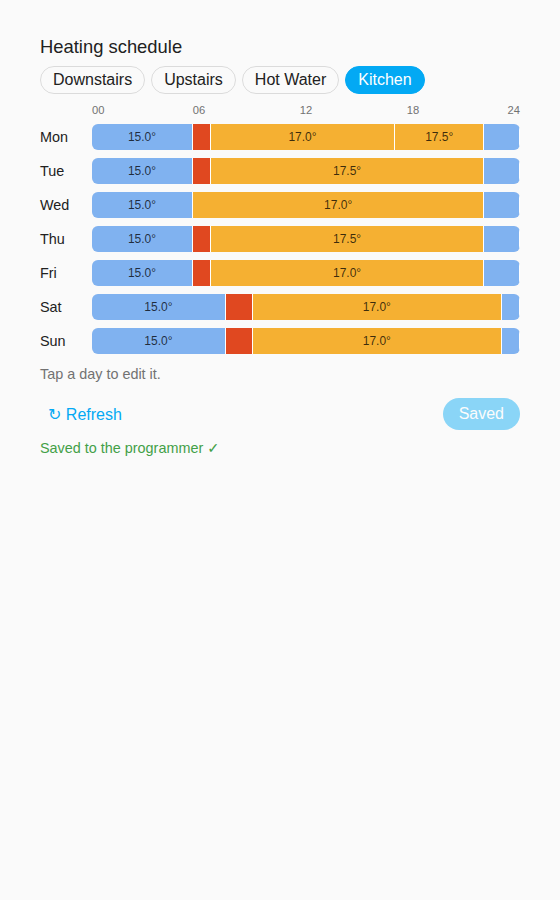
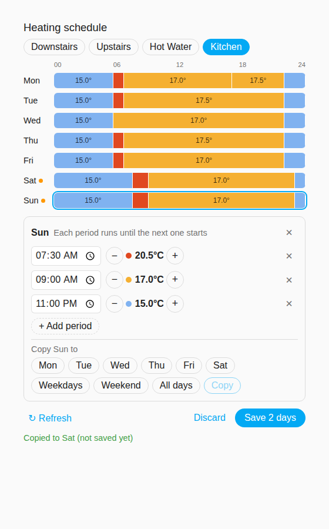

# 🏠 Secure Controls Thermostat (Home Assistant Integration)

[](https://hacs.xyz/)
[](https://my.home-assistant.io/redirect/config_flow_start/?domain=securecontrols_thermostat)


A custom [Home Assistant](https://www.home-assistant.io) integration for **Secure Controls smart thermostats and multi-zone programmers (H3747, C1727)**, connecting via the official **Beanbag Cloud API** and **WebSocket** interface.

This integration provides cloud-based two-way communication with Secure thermostats — including temperature, humidity, power data, and remote control from Home Assistant.

---

## ✨ Features

- 🔐 Secure authentication using your Beanbag account  
- 🌡️ Temperature, humidity, and power updates every 45 seconds
- ⚙️ Control target temperature, mode, and preset  
- ⚡ Power usage telemetry (where supported)  
- 🧱 Multi-gateway support  
- 🔐 One retained cloud connection per session that latches and stops instead of fighting the mobile app for it
- 🧩 Exposes native Home Assistant entities:
  - `climate` — main thermostat
  - `sensor` — humidity and power metrics

---

## ✅ Supported devices

Anything you control with the **Secure Controls** app over Wi-Fi uses the same cloud, but
each model lays its data out differently. Status so far:

| Device | Status |
|---|---|
| Secure smart thermostat (single zone) | Supported (original integration) |
| **H3747** 4-channel programmer + SCW100 Wi-Fi card | Verified on a live system (3 heating zones + hot water): readings, target temperature, hot water boost, and reading and writing weekly schedules |
| **C1727** 2-channel programmer + SCW100 Wi-Fi card | Same platform as the H3747, so expected to work; not yet confirmed |
| Other models (E7+, Beanbag, ...) | Not supported; see *Help add your device* below |

The programmers need the plug-in Wi-Fi card: over Bluetooth alone they are not reachable
from the cloud.

## 🔥 Multi-zone programmers (H3747 / C1727)

Secure smart programmers with the plug-in Wi-Fi card (SCW100) are supported. The zone
layout is read from the cloud (`zones.read`), and each zone gets its own device:

| Zone type | Entities |
|---|---|
| Heating zone (PTD or wireless sensor) | `climate` (target temperature; away/home preset on zone 1), current / target / next target temperature, next schedule change, humidity (when the display has a humidity sensor) |
| Hot water channel | `switch` Boost (on = 60 min boost, off = cancel), `binary_sensor` Heating (on while scheduled or boosting), next schedule change / boost end |
| Every zone | `calendar` Schedule: the zone's weekly program on the programmer |

Custom boost length: service `securecontrols_thermostat.boost` with `minutes` (1–240).

Zone names come from the Secure Controls app, so rename zones there before adding the
integration if you want matching entity IDs (e.g. `climate.kitchen`).

## 🗓️ Schedules

Each zone's weekly schedule lives **on the programmer**. Home Assistant can read and edit
it, and the programmer keeps running it even if Home Assistant or the internet is down.

- **See it:** each zone has a `calendar.<zone>_schedule` entity, so schedules appear in
  Home Assistant's Calendar. Heating blocks show their temperature, and hot water shows
  when it's on. Each climate entity also has a `scheduled_temperature` attribute.
- **Read it:** `securecontrols_thermostat.get_schedule` returns the week in the same
  format `set_schedule` takes, so you can copy, edit and send it back.
- **Change it:** `securecontrols_thermostat.set_schedule` replaces only the days you give.
  Up to 6 periods per day, and each period runs until the next one starts. The programmer
  is read back afterwards to confirm it stored what was sent.

```yaml
action: securecontrols_thermostat.set_schedule
target:
  entity_id: calendar.downstairs_schedule
data:
  schedule:
    weekdays:
      - { start: "06:30", temperature: 20 }
      - { start: "08:30", temperature: 16 }
      - { start: "17:30", temperature: 20.5 }
      - { start: "22:30", temperature: 15 }
    weekend:
      - { start: "08:00", temperature: 20 }
      - { start: "23:00", temperature: 15 }
```

Hot water uses `state` instead of `temperature`:
`- { start: "06:00", state: on }` / `- { start: "07:00", state: off }`.
Days can be `monday`…`sunday`, `weekdays`, `weekend` or `all`. Temperatures are 5–30 °C in
0.5 °C steps.

### Schedule card

The integration adds a dashboard card for editing schedules, much like the app's schedule
screen. It loads automatically: there's nothing to add under Resources.

1. Edit a dashboard → **Add card** → search for **Secure Controls schedule**, or add a
   Manual card with:

   ```yaml
   type: custom:securecontrols-schedule-card
   ```

   Without `entity`, the card shows a tab for every zone. Use
   `entity: calendar.kitchen_schedule` for one zone only, and `title:` for your own heading.
2. Tap a day to edit it. Change start times, use − / + for temperature (0.5° steps) or
   On / Off for hot water, and add or remove periods (up to 6).
3. **Copy** a day to other days, or to Weekdays / Weekend / All days.
4. **Save** sends only the days you changed. The programmer is read back to confirm, and
   any problem is shown on the card. **Discard** drops unsaved edits, and **Refresh**
   re-reads the schedule from the programmer.

<p>
</p>

After updating the integration, refresh the browser (or clear the app's cache) so the new
card version loads.

### Blueprints

Ready-made automations in [`blueprints/automation/securecontrols_thermostat`](blueprints/automation/securecontrols_thermostat).
Import them from **Settings → Automations & scenes → Blueprints → Import blueprint** using
the file's GitHub URL.

| Blueprint | What it does |
|---|---|
| Switch schedule profile | Writes one of two weekly schedules to a zone when a toggle, presence group or calendar changes (working from home, holidays, winter/summer) |
| Away when nobody is home | Uses the programmer's Away mode once everyone has left, Home when someone returns |
| Pause heating while a window is open | Turns a zone down while a window is open, then back to its scheduled temperature |

Schedule changes are written to the programmer, so they survive outages. Short-term
overrides (open window, away) only change the current target, and the programmer's own
schedule resumes at its next switch point anyway.

Protocol notes for these models:

- **Requests must stay under ~1 KB.** The programmer silently ignores anything larger (no
  reply, no error). A weekly schedule is 898 bytes as compact JSON but 1083 bytes with the
  usual `", "` / `": "` separators, so all requests are sent compact, as the official app does.

- Heating zones: state block `SI:15`, one block per zone with slot = zone number.
  Items: `1` target, `2` ambient, `8` humidity (`255` = not fitted), `9` next change
  (minutes since local midnight), `10` next target. Away/home (`6`) and frost (`11`) are
  on zone 1 only. Target writes: `HI:2 SI:15 [zone, {I:1, V:<deci°C>, OT:1, D:0}]`.
- Hot water: state block `SI:16` on its channel's slot. `4` boost (`V:1, OT:2, D:<min>`
  while boosting), `9` next change / boost end, `10` state after the next change.
  Boost: `HI:2 SI:16 [ch, {I:4, V:0, OT:2, D:<min>}]`, cancel with `D:0`.
- Weekly programs: read `HI:22 SI:17 [zone]`, write `HI:21 SI:17 [{I:zone, D:[...]}]`,
  7 days × 6 switch points (Mon first), `O` = minutes since midnight, `T` = deci°C for
  heating, `1`/`0` for hot water; unused points `{O:65535, T:65535}`. Heating days always
  carry 6 points on the device, so shorter days are padded with no-op repeats.

---

## 📦 Installation

### Option 1 — HACS (Recommended)
1. In Home Assistant, open **HACS → Integrations → Custom Repositories**
2. Add this repository’s URL:
   ```
   https://github.com/andydean565/ha-securecontrols-thermostat
   ```
3. Select category **Integration**
4. Install **Secure Controls Thermostat**
5. Restart Home Assistant

### Option 2 — Manual
1. Copy the folder `custom_components/securecontrols_thermostat` into your HA config directory:
   ```
   config/custom_components/securecontrols_thermostat/
   ```
2. Restart Home Assistant

---

## ⚙️ Configuration

1. Go to **Settings → Devices & Services → + Add Integration**
2. Search for **Secure Controls Thermostat**
3. Enter your **Beanbag Cloud email** and **password**
4. The integration will:
   - Authenticate using the Secure Controls API  
   - Discover your gateways and thermostats  
   - Poll the thermostat every 45 seconds over one persistent WebSocket

[](https://my.home-assistant.io/redirect/config_flow_start/?domain=securecontrols_thermostat)

---

## 🧠 Technical Overview

### Authentication
Uses the Beanbag Cloud REST endpoint:
```
POST /api/UserRestAPI/LoginRequest
```
Payload includes MD5-hashed password; returns a JWT (`JT`) and Session ID (`SI`).

### WebSocket Control
The integration opens one WebSocket after login and reuses it for every poll
and command until it is unloaded or the connection becomes unusable. Reads and
writes are serialized on that single connection; Beanbag does not reliably
accept a second WebSocket for the same session, so the socket is only closed
on unload, a timeout, a transport failure, or a session rejection from the
server.

```
wss://app.beanbag.online/api/TransactionRestAPI/ConnectWebSocket
Headers:
  Authorization: Bearer <JWT>
  Session-id: <SessionId>
Subprotocol:
  BB-BO-01
```

Polling still happens every 45 seconds, but over that one retained connection
rather than a fresh socket each time.

Opening the Secure Controls mobile app can invalidate Home Assistant's Beanbag
session — the two cannot reliably hold the session at the same time, and the
integration deliberately stops making cloud requests rather than repeatedly
signing back in and fighting the app for it. To hand the session back to Home
Assistant, fully quit the mobile app and then reload the integration from
**Settings → Devices & services**.

Example telemetry payload:
```json
{
  "type": "telemetry",
  "gateway_id": "63303415198340",
  "device_id": "C0032725",
  "ambient_c": 21.3,
  "target_c": 22.0,
  "humidity": 46.5,
  "power": 1,
}
```

---

## 📁 Folder Structure

```
custom_components/securecontrols_thermostat/
├── __init__.py           # integration setup
├── api.py                # HTTP + WebSocket client
├── coordinator.py        # polling, zone parsing, schedule read/write
├── schedule.py           # weekly program <-> friendly format
├── climate.py            # one climate entity per heating zone
├── sensor.py             # temperatures, humidity, next change
├── switch.py / binary_sensor.py   # hot water boost / heating
├── calendar.py           # schedules as calendars + get/set_schedule
├── frontend/             # schedule card (served automatically)
├── config_flow.py        # Config Flow for login
├── manifest.json
└── icon.png / logo.png
```

---

## 💡 Credits

- 🔍 **API research & understanding** inspired by [ha-securemtr](https://github.com/ha-securemtr/ha-securemtr) —  
  their work on Secure Meters protocols was invaluable in decoding this API.

---

## 🪪 License

MIT License © 2025 andrew dean

---

## 🧩 Add to Home Assistant

Click below to add the integration directly in your Home Assistant instance:

[](https://my.home-assistant.io/redirect/config_flow_start/?domain=securecontrols_thermostat)

---

## 🙋 Help add your device

If your Secure device isn't supported, or something shows up wrong, you can capture what
it reports without any risk to your heating:

1. Download [`tools/secure_probe.py`](tools/secure_probe.py) and run
   `pip install aiohttp && python3 secure_probe.py --listen 240`.
2. Sign in with your Secure Controls app login. The probe only *reads*; it never sends a
   command to your device.
3. While it says **Watching**, make one change at a time in the app, about 20 seconds
   apart (e.g. zone 1 +1 °C, zone 2 +1 °C, hot water boost on, boost off), and note the order.
4. It saves `secure_probe.json` with serial numbers, IDs, names, location and your email
   replaced by placeholders. Look through it, then attach it to a GitHub issue with your
   model, your list of changes, and which channel does what.

## 🧪 Tests

```
pip install -r requirements-dev.txt
pytest                      # unit tests (API, coordinator, captured H3747 payload)
pip install pytest-homeassistant-custom-component
pytest tests_ha -o asyncio_mode=auto   # loads the integration into a real HA instance
```
